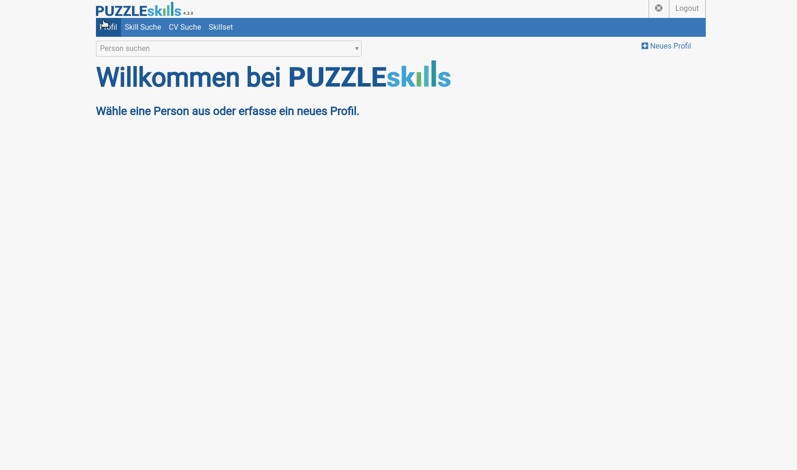

[](https://github.com/puzzle/skills/issues)


[](https://www.gnu.org/licenses/agpl-3.0)


PuzzleSkills is an open source web application to facilitate skill management.   
With the help of PuzzleSkills users can manage their profiles, CVs and Skills.
Managing employees and gaining an overview of each of their skills has never been easier.



## Prerequisites

You will need the following things properly installed on your computer:

-   [Git (Version Control System)](http://git-scm.com/)
-   [RVM (Ruby Version Manager)](https://rvm.io/) ([installation](https://rvm.io/rvm/install) requires `curl` and `gpg`)
-   Either [PostgreSQL](https://www.postgresql.org/) or [Docker](https://www.docker.com/) for the Database (Docker is recommended)

## 📄 Changelog
See what’s new in the latest versions by checking the [CHANGELOG.md](https://github.com/puzzle/skills/blob/master/doc/CHANGELOG.md).


## Setup dockerized Application👩🏽‍💻
We're glad you want to setup your machine for PuzzleSkills development 💃

### Windows users
If you're on Windows you should be able to Download Ubuntu from the Microsoft Store. Note that you need to enable Subsystem for Linux and virtual machine platform in your Windows features.  
Then you can open Ubuntu and follow the manual using the Ubuntu console.  
Once you're done, open your Windows IDE and navigate to the skills folder located in your Linux subsystem under Ubuntu to start developing.
If this doesn't work you can always use a VM.

First you need to clone this repository:

```bash
mkdir -p ~/git/ && cd ~/git/
git clone https://github.com/puzzle/skills.git && cd ~/git/skills
```

⚡ If your user id is not 1000 (run id -u to check), you need to export this as an env variable: **export UID=$UID** before running any of the further commands. You may want to add this to your `.bashrc` file for convenience.

## Start Development Containers


**Without Keycloak (recommended)**
Since this is the default, you don't have to do anything and can run all commands inside the root of the project.

**With Keycloak**
To use the application with Keycloak, navigate to `config/docker/keycloak` and run all commands from this directory.
You can log in either as `user` or as `admin`. The password for both accounts is `password`.


### Start application
To start the PuzzleSkills application, run the following commands in your shell:

```bash
docker compose up -d
```

⚡ This will also install all required gems and seed the database, which takes some time to complete if it's executed the first time. You can follow the progress using `docker logs -f rails` (exit with Ctrl+C).

After the startup has completed (once you see `Listening on http://0.0.0.0:3000` in the logs), make sure all services are up and running:

```bash
docker ps
```

This should look something like this:

```
IMAGE              COMMAND                   CREATED          STATUS           PORTS                                       NAMES
ruby:3.4.1         "/bin/bash -c '\n cur…"   11 seconds ago   Up 9 seconds                                                 assets
skills-dev/rails   "rails-entrypoint ra…"    11 seconds ago   Up 9 seconds     0.0.0.0:3000->3000/tcp, :::3000->3000/tcp   rails
postgres:16        "docker-entrypoint.s…"    11 seconds ago   Up 10 seconds    0.0.0.0:5432->5432/tcp, :::5432->5432/tcp   postgres
```

Access the web application by browser: http://localhost:3000 and enjoy the ride!

## Skill snapshot for departments
The core competence of this feature is to track how many people in a department have a given skill. This also includes tracking the level of the skill.
It works by running a monthly DelayedJob that creates these 'Snapshots' for each department.
You can then take a look at these Snapshots using `chart.js` to see how the amount people with certain skills have changed over the span of a year. 
This also features a soft-delete for skills since we want to be able to access skills that have been a thing in the past.
For local development dynamically generated, extensive seeds are available for each department and skill.

**Make sure to start the delayed job worker**, otherwise the job won't be executed. You can find help on how to do this in
[the delayed job documentation](https://github.com/collectiveidea/delayed_job?tab=readme-ov-file#running-jobs)
or just simply run `rails jobs:work` to start working off queued delayed jobs.

## PuzzleTime synchronization
If you are using PuzzleSkills as an external company and are not also using the PuzzleTime application, this part of the
application will not bother you.

### Description of the PuzzleTime sync
The PuzzleTime sync was written to reduce data redundancy and maintain a single source of truth for people data. It is
possible to gather the data from multiple instances of PuzzleTime but every person in PuzzleSkills will only be updated
by a single instance of PuzzleTime. Be aware that when the sync is run, profiles would be created multiple times if they have
employments in multiple providers, so you should avoid this. An initial mapping script assigns each person a `ptime_employee_id`
and a `ptime_data_provider`, which are then used to update them. A nightly delayed job runs at `3am` to fetch employee data
from the PuzzleTime API(s). This data is used to update people in the application. While the sync is active, users are not
allowed to edit certain attributes of a person or delete them.

The sync also creates new people when needed or sets people to inactive (in which case they will no longer be updated).

### How to enable it
The PuzzleTime sync depends on the environment variable (ENV variable) `USE_PTIME_SYNC`, which defaults to false.
This default value is defined in the `use_ptime_sync?` method in the `application.rb` file.

### Manual sync
Sometimes, synchronization may be needed during the day instead of waiting for the nightly job. For this purpose,
a manual sync button has been added to the admin view (/admin/update_people). This button immediately executes the 
delayed job and updates all people accordingly.

### Setup
This is a step for step manual on how to run the PuzzleTime sync. 
1. Enable the sync by setting the environment variable `USE_PTIME_SYNC` to `true`.
2. Make sure your instance(s) of the PuzzleTime application is/are up and running so the API(s) is/are accessible.
3. The URL and the credentials for the PuzzleTime API(s) need to be set via environment variables for the sync to work.
   To do this, set the following env vars per provider:

   | Variable                                | Description                                                                                                                                                                                      |
   |-----------------------------------------|--------------------------------------------------------------------------------------------------------------------------------------------------------------------------------------------------|
   | `PTIME_PROVIDER_<n>_BASE_URL`           | The base URL of your PuzzleTime instance                                                                                                                                                         |
   | `PTIME_PROVIDER_<n>_API_USERNAME`       | The API username configured in your PuzzleTime instance                                                                                                                                          |
   | `PTIME_PROVIDER_<n>_API_PASSWORD`       | The API password configured in your PuzzleTime instance                                                                                                                                          |
|  | `PTIME_PROVIDER_<n>_COMPANY_IDENTIFIER` | The company identifier is used to tell apart the different providers but must also match the name of a company in your database, because a person will be assigned this company as it is updated |
   
   `<n>` is to be replaced with a number, e.g. `PTIME_PROVIDER_0_BASE_URL`. For every provider number, all 4 properties have to be set.
4. If this is the very first time you're setting up the sync, you need to assign each person a `ptime_employee_id` and a `ptime_data_provider` which
   links to their corresponding account in PuzzleTime. This is done using their email addresses. This mapping is only done for people that have an active
   employment in their respective PuzzleTime provider.
      - To perform the linking, run this command `rake ptime:assign`
      - To see who will be linked without actually making changes (a dry run), run `rake ptime:evaluate_assign`
5. Make sure you start the delayed job worker, otherwise the job won't be executed. You can find help on how to do this in
   [the delayed job documentation](https://github.com/collectiveidea/delayed_job?tab=readme-ov-file#running-jobs). In the `dev`
   environment we have a docker-compose service for this.
6. Assuming all these steps have been followed correctly, the nightly delayed job should execute the sync. You can try by
   navigating to `/admin/update_people` and pressing the manual sync button.
7. *Optional*: If you need the sync to happen more than once a day, you can change the 
   schedule by modifying the cron expression in the `NightlyUpdatePeopleDataPtimeJob.`

## Debugging
To interact with `pry` inside a controller, you have to attach to the container first using `docker attach rails`.
This will show you any **new** logs, and if you encounter a `pry` prompt, you can interact with it.
**To detach from the container without stopping it, press `CTRL + p` then `CTRL + q`.**

## Testing

-   To run the backend tests run `rake spec`
-   To test with a non-admin user, change the email in `app/controllers/application_controller.rb#authenticate_auth_user"` to "user@skills.ch"
-   To run the tests within the docker container use `bin/test`
## Hooks
- To install the pre-commit hooks run `overcommit --install`
## Documentation
Find further Documentation at the links below

[Changelog](https://github.com/puzzle/skills/blob/master/doc/CHANGELOG.md)  
[Contributing](https://github.com/puzzle/skills/blob/master/doc/CONTRIBUTING.md)  

