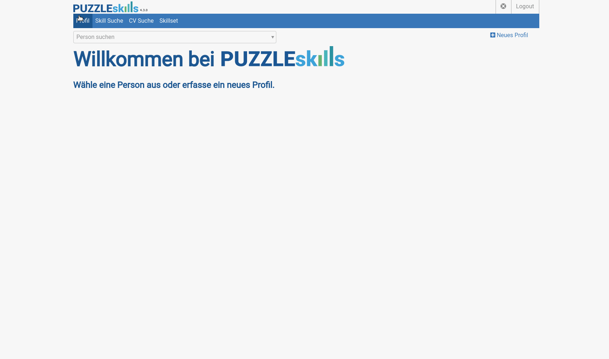

[](https://github.com/puzzle/skills/issues)


[](https://www.gnu.org/licenses/agpl-3.0)


PuzzleSkills is an open source webapplication to facilitate skill management.   
With the help of PuzzleSkills Users can manage their profiles, CVs and Skills.
Managing employees and getting an overview of each of their skills has never been easier.



## Prerequisites

You will need the following things properly installed on your computer:

-   [Git (Version Control System)](http://git-scm.com/)
-   [RVM (Ruby Version Manager)](https://rvm.io/) ([installation](https://rvm.io/rvm/install) requires `curl` and `gpg`)
-   Either [PostgreSQL](https://www.postgresql.org/) or [Docker](https://www.docker.com/) for the Database (Docker is recommended)

## Setup dockerized Application👩🏽‍💻
We're glad you want to setup your machine for PuzzleSkills development 💃

### Windows users
If you're on Windows you should be able to Download Ubuntu from Microsoft Store. Note that you need to enable Subsystem for Linux and virtual machine platform in your Windows features.  
Then you can open Ubuntu and follow the manual using the Ubuntu console.  
When you finished use your Windows IDE and open the skills folder that's located in your Linux subsystem -> Ubuntu and start developing.  
If this doesn't work you can always use a VM.

First you need to clone this repository:

```bash
mkdir -p ~/git/ && cd ~/git/
git clone https://github.com/puzzle/skills.git && cd ~/git/skills
```

⚡ If your user id is not 1000 (run id -u to check), you need to export this as env variable: **export UID=$UID** before running any of the further commands. Maybe you want to add this to your bashrc.

## Start Development Containers


**Without Keycloak (recommended)**
Since this is the default, you don't have to do anything and can run all commands inside the root of the project.

**With Keycloak**
To use the application with Keycloak, navigate to `config/docker/keycloak` and run all commands from this directory.
You can log in either as `user` or as `admin`. The password for both accounts is `password`.


### Start application
To start the PuzzleSkills application, run the following commands in your shell:

```bash
docker compose up -d
```

⚡ This will also install all required gems and seed the database, which takes some time to complete if it's executed the first time. You can follow the progress using `docker logs -f rails` (exit with Ctrl+C).

After the startup has completed (once you see `Listening on http://0.0.0.0:3000` in the logs), make sure all services are up and running:

```bash
docker ps
```

This should look something like this:

```
IMAGE              COMMAND                   PORTS                                       NAMES
ruby:3.2           "/bin/bash -c '\n apt…"                                               assets
skills-dev/rails   "rails-entrypoint ra…"    0.0.0.0:3000->3000/tcp, :::3000->3000/tcp   rails
postgres:16        "docker-entrypoint.s…"    0.0.0.0:5432->5432/tcp, :::5432->5432/tcp   postgres
```

Access the web application by browser: http://localhost:3000 and enjoy the ride!

## PuzzleTime synchronisation
If you are using PuzzleSkills as an external company this part of the application will only bother you once. The only thing you need to know is how to disable it.

### Description of the PuzzleTime sync
The PuzzleTime sync was written to make people data less redundant and have a single source of truth. A nightly delayed job
that runs at midnight fetches employee data from the PuzzleTime API. The fetched data is then mapped and displayed
as people attributes in the application. While the PuzzleTime sync is active, the user is not allowed to edit certain
attributes of a person. The synchronisation also makes sure to create new people or set people to inactive which results
in them not being updated anymore.

### How to disable it
The whole PuzzleTime sync is dependent on a ENV variable, for which a default value can be set in the 'use_ptime_sync?'
method. The default value is true but can easily set to false. This method is defined in the `application.rb` file.

### Manual sync
There may be cases where the synchronisation needs to be done throughout the day instead of at midnight. For this exact
case a manual sync button has been added to the admin view. This button instantly executes the delayed job and
updates all persons accordingly.

## Debugging
To interact with `pry` inside a controller, you have to attach to the container first using `docker attach rails`.
This will show you any **new** logs, and if you encounter a `pry` prompt, you can interact with it.
To detach from the container without stopping it, press `CTRL + p` then `CTRL + q`.


## Testing

-   To run the backend tests run `rake spec`
-   To use a user without admin privileges change email in `app/controllers/application_controller.rb#authenticate_auth_user"` to "user@skills.ch"

## Documentation
Find further Documentation at the links below

[Changelog](https://github.com/puzzle/skills/blob/master/doc/CHANGELOG.md)  
[Contributing](https://github.com/puzzle/skills/blob/master/doc/CONTRIBUTING.md)  

